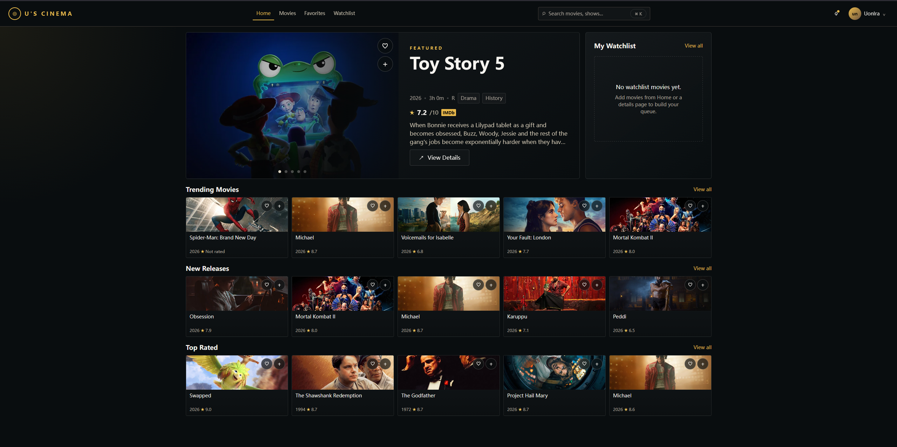
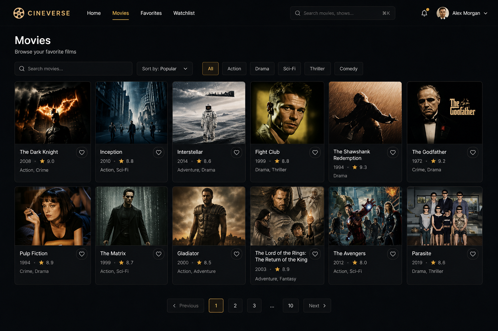
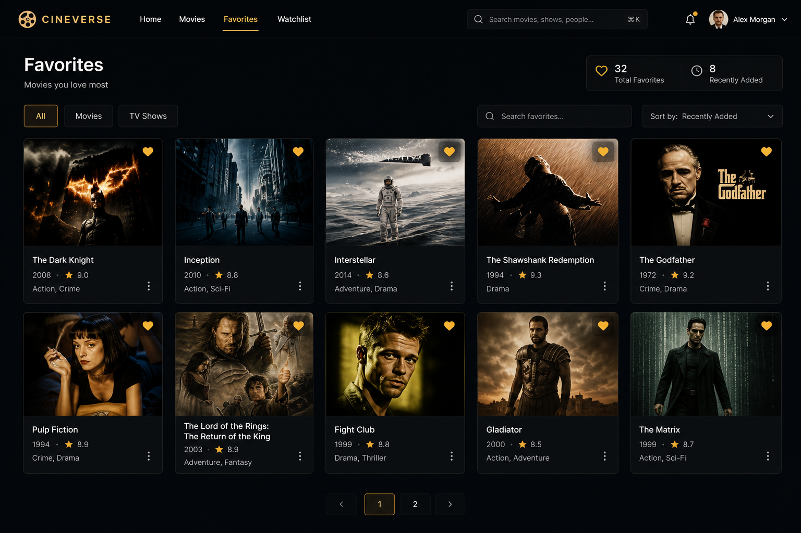
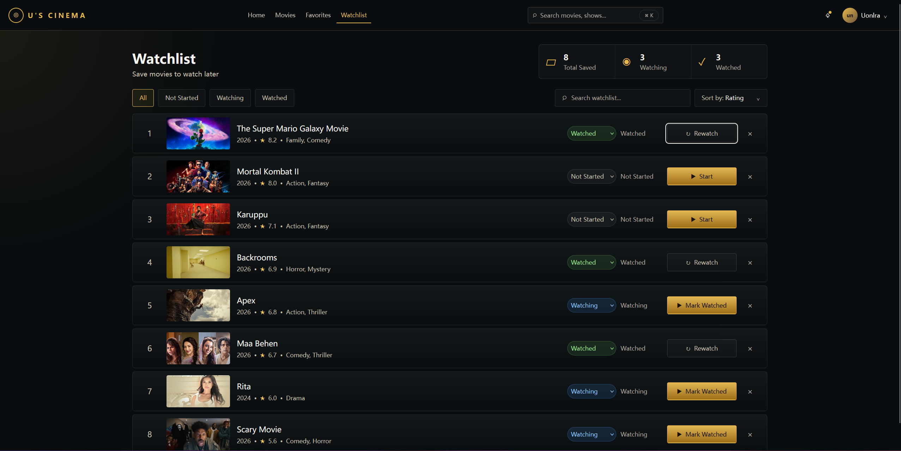

# U-s-cinema

U-s-cinema 是一个以电影发现和个人片库管理为核心的 React 单页应用。项目使用 **React + TypeScript + Vite** 构建，接入 TMDB API，实现电影浏览、搜索筛选、详情弹窗、收藏、Watchlist 状态管理和本地持久化。

这个项目最初是 JavaScript React 练习项目，后续逐步迁移到 TypeScript。目前 API 层、Context、Hooks、页面层和主要组件都已经完成类型封装。

## 项目预览

### 首页 Home



### 电影列表 Movies



### 收藏页 Favorites



### 观看清单 Watchlist




## 核心功能

- 首页电影仪表盘，展示 Featured 电影和多组横向电影分区
- Featured 轮播支持圆点切换、自动切换、hover 暂停和键盘左右切换
- 顶部搜索栏驱动首页搜索结果展示
- Movies 页面支持搜索、类型筛选、排序和分页
- 点击电影以悬浮弹窗方式打开详情，不作为 Navbar 页面
- 电影详情弹窗展示背景图、海报、评分、片长、语言、类型和简介
- 支持添加/取消 Favorites
- 支持添加/移除 Watchlist
- Watchlist 支持 `Not Started`、`Watching`、`Watched` 状态
- Favorites 和 Watchlist 数据通过 `localStorage` 持久化
- 顶部通知按钮和用户信息区域支持暗色下拉菜单
- 包含加载骨架、空状态、错误状态和图片缺省状态

## 技术栈

- React
- TypeScript
- Vite
- React Router
- Context API
- TMDB API
- localStorage
- CSS
- ESLint

## 项目结构

```text
U-s-cinema/
├── DESIGN.md
├── README.md
└── MainFile/
    ├── docs/
    │   └── screenshot/
    │       ├── HomePage.png
    │       ├── MoviePage.png
    │       ├── FavPage.png
    │       ├── WatchListPage.png
    │       └── movie-detail-ui.svg
    ├── package.json
    └── fronted/
        ├── public/
        ├── src/
        │   ├── components/      # 复用 UI 组件
        │   ├── Contexts/        # 全局片库与详情弹窗状态
        │   ├── constants/       # 类型、排序、观看状态等静态配置
        │   ├── css/             # 全局样式、页面样式和组件样式
        │   ├── hooks/           # 自定义 Hooks
        │   ├── pages/           # 路由页面
        │   ├── services/        # TMDB API 请求封装
        │   ├── types/           # TypeScript 共享类型
        │   ├── utils/           # 电影格式化工具
        │   ├── App.tsx
        │   └── main.tsx
        ├── package.json
        ├── tsconfig.json
        └── vite.config.js
```

## 本地运行

进入前端项目目录：

```bash
cd MainFile/fronted
```

安装依赖：

```bash
npm install
```

创建本地环境变量文件：

```bash
cp .env.example .env
```

在 `.env` 中填写 TMDB API Key：

```text
VITE_TMDB_API_KEY=your_tmdb_api_key
```

启动开发服务器：

```bash
npm run dev
```

默认访问地址：

```text
http://localhost:5174
```

## 可用脚本

在 `MainFile/fronted` 目录中运行：

```bash
npm run dev        # 启动 Vite 开发服务
npm run typecheck  # 执行 TypeScript 类型检查
npm run lint       # 执行 ESLint 检查
npm run build      # 生产构建
npm run preview    # 预览生产构建结果
```

也可以在 `MainFile` 目录使用转发脚本：

```bash
cd MainFile
npm run dev
npm run build
npm run lint
npm run preview
```

## TypeScript 迁移状态

当前项目已经完成主要 TypeScript 迁移：

- `services/api.ts`：封装 TMDB 请求、错误处理和分页响应类型
- `types/movie.ts`：定义电影、电影详情、类型和分页响应
- `types/library.ts`：定义片库条目和 Watchlist 状态
- `Contexts/`：收藏、Watchlist 和详情弹窗 Context 已类型化
- `hooks/`：Featured 轮播 Hook 已类型化
- `pages/`：Home、Movies、Favorites、Watchlist、MovieDetails 已迁移为 TSX
- `components/`：核心 UI 组件已迁移为 TSX

## 当前验证状态

项目当前通过：

```bash
npm run typecheck
npm run lint
npm run build
```

## 后续可优化方向

- 增加 Cast、Trailer、Similar Movies 等详情页内容
- 增加单元测试和组件测试
- 优化移动端下拉菜单和详情弹窗体验
- 增加主题切换逻辑
- 添加部署配置和在线预览地址
